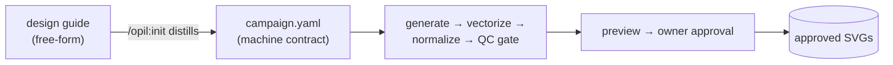

# OpenIllust

**Campaign-driven AI vector asset production for Claude Code and Codex.**

Give it a design language — any free-form style guide — and OpenIllust turns it into a consistent,
production-ready SVG asset set: toolbar icons, logos, illustrations. AI generates, a specialized
converter vectorizes, deterministic scripts normalize and gate, and you approve. Nothing ships
that doesn't pass the campaign's machine-readable contract.



## Why

- **Consistency is enforced, not hoped for** — three layers: a text contract (your design guide,
  distilled), a visual contract (approved anchors shown at every generation), and a code contract
  (palette/canvas/margin QC that fails loudly instead of auto-fixing).
- **The AI proposes, you approve** — batch sheets and freeform conversions both run through an
  explicit plan → approval → execution loop.
- **Deterministic where it counts** — creative judgment stays with the agent and you; everything
  repeatable (cropping, normalization, validation, provenance) is plain Python you can rerun.

## Requirements

- Node.js ≥ 18 (for the installer CLI)
- Python ≥ 3.10 (the toolchain: Pillow, svgelements, vtracer, PyYAML — installed for you)
- Claude Code and/or OpenAI Codex
- Optional: a [Recraft](https://www.recraft.ai) API key for the highest-quality raster→vector
  conversion (~$0.01/image), in your project's `.env` as `RECRAFT_API_KEY=...` — or run fully
  local and keyless with the `vtracer` provider

## Install

```bash
npm install -g @opellen/openillust
openillust install          # registers the skill + /opil: commands
                            #   Claude Code: .claude/skills, .claude/commands (or --global)
                            #   Codex:       ~/.codex/skills, ~/.codex/prompts (as /opil-<name>)
```

## Quick start

```bash
cd your-project
openillust init mybrand     # scaffolds .openillust/campaigns/mybrand/ + .env
```

Then, inside Claude Code (or Codex):

```
> /opil:init mybrand
  # finds your design guide, distills it into campaign.yaml, interviews you for gaps,
  # and asks for your approval — the contract every later step obeys

> /opil:sheet toolbar icons: new, search, tag, pin, archive, share, trash, settings, sync
  # plans a 3x3 sprite sheet, builds a generation kit for you to run in your image model,
  # then crops → vectorizes → normalizes → QC-gates → preview

> /opil:vectorize moodboard.png
  # analyzes arbitrary art, proposes a per-asset plan (vectorize / re-author / typeset /
  # exclude), executes after your approval — text is never traced
```

## Commands

| Command | Does |
|---|---|
| `/opil:init <name>` | Create or resync a campaign: distill the design guide into `campaign.yaml` (with your approval) |
| `/opil:sheet <assets>` | Batch-produce a family via one sprite sheet — resumable at every stage |
| `/opil:vectorize <image>` | Freeform art → per-asset vectorization plan → approved execution |
| `/opil:redo <slug>` | Rework one rejected asset, chained to your approved anchors |
| `/opil:review` | Walk the approval loop; promote anchors; record verdicts |
| `/opil:status` | Campaign dashboard derived from the filesystem |

## How it holds together

- **Campaign contract** — `.openillust/campaigns/<name>/campaign.yaml`: palette whitelist,
  gradients, canvas, stroke rules, QC thresholds, prompt blocks. Schema ships with the skill
  (`references/campaign-schema.md`). Your guide stays free-form; the agent is the format adapter.
- **QC is a gate, not a fixer** — 18 deterministic checks (`qc_svg.py --strict --campaign`).
  A failure means regenerate, never silently patch.
- **Directory-as-state** — sheets and plans resume from what's on disk; interrupt anything.
- **Provenance** — every asset keeps the prompt or plan that produced it.

## Vectorizer providers

| Provider | Runs | Cost | Quality | Key |
|---|---|---|---|---|
| `recraft` (default) | Recraft API | ~$0.01/image | best-in-class flat-art tracing | `RECRAFT_API_KEY` in `.env` |
| `vtracer` | locally | free | good on simple flat shapes; rougher curves | none |

Set it per campaign (`tooling.vectorizer` in `campaign.yaml`), per run (`--provider`), or via
`OPENILLUST_VECTORIZER`. Missing key = loud error, never a silent downgrade — and either way,
every output passes the same normalize + QC gate. Pin one provider per asset family.

## Repo layout

```
templates/skills/openillust/   the skill: SKILL.md, references/, Python tools
templates/commands/opil/       the six commands
src/                           installer CLI (TypeScript)
docs/                          workflow deep-dives and design history
```

## License

MIT © San (opellen)
