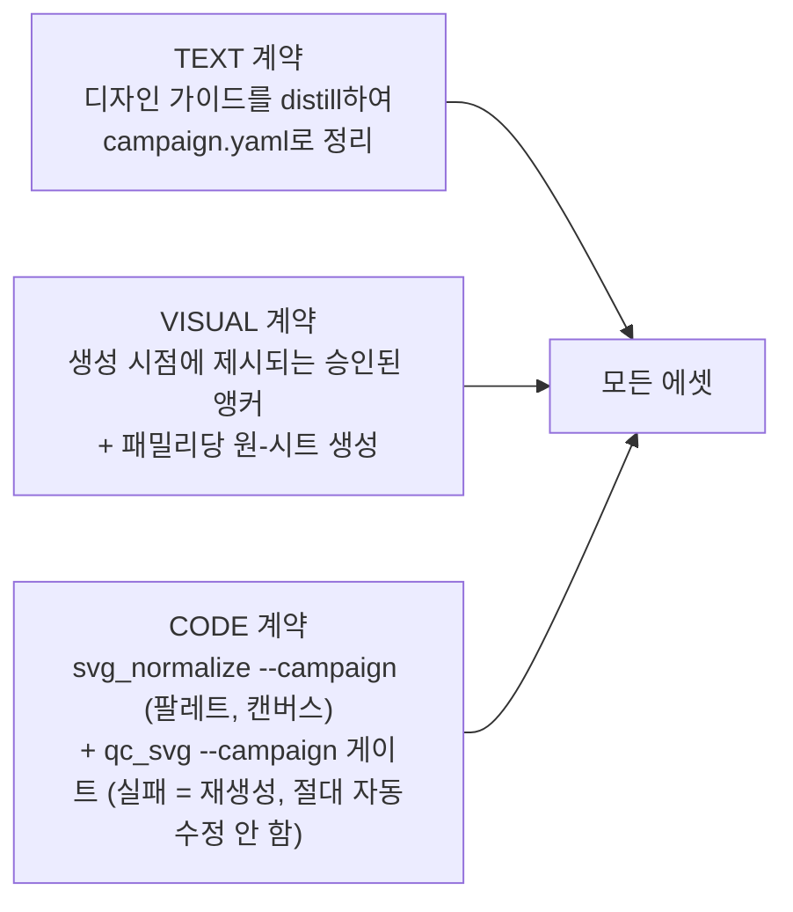
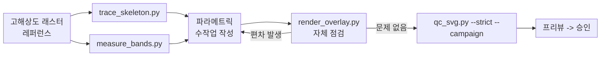

# OpenIllust 워크플로우 딥다이브 (Workflow Deep Dive)

[`WORKFLOW.md`](WORKFLOW.md) 뒤에 있는 컴포넌트별 세부 사항을 다룬다: 각 스크립트와 산출물이 실제로 무엇을
하는지, 왜 존재하는지, QC 규칙 표, 프리폼 플랜/승인 시맨틱스, `/opil:*` 커맨드 표면, 캠페인 계약 스키마.
파이프라인 다이어그램과 3계층 일관성 모델은 개요 문서를 먼저 읽을 것 — 이 문서는 그것들을 다시 그리지
않는다.

두 캠페인이 이 워크플로우를 엔드투엔드로 검증했다: **Planura**(3D 건축 모델링 앱; 9개 아이콘으로 구성된
드로잉 툴 패밀리를 시트 파이프라인으로 제작)와 **OpenGoal**(워드마크/로고 에셋을 프리폼 플랜 파이프라인으로
제작). 둘 다 외부 캠페인이며 이 저장소 자체의 콘텐츠가 아니다 — 아래에서 등장하는 헥스 값, 그라데이션 id,
스트로크 범위, 프롬프트 문구는 모두 해당 캠페인의 `campaign.yaml`에서 가져온 실제 예시일 뿐, OpenIllust
자체의 고정된 규칙이 아니다.

## 일관성 모델 요약 (Consistency Model Recap)



| 주체 | 역할 |
|---|---|
| 오너(Owner, 인간) | 컨셉 아트, 이미지 생성(gpt-image) 실행, 시각적 승인, 악센트/스타일 결정, `campaign.yaml`과 플랜 승인 |
| 에이전트 (Claude/Codex) | 매니페스트, 프롬프트, 캠페인 distillation, 컬러 `--map` 선택, 플랜 작성, 자체 점검, 리페어 |
| 스크립트 | 결정론적인 모든 작업: 키트 빌드, 크로핑, 변환, 정규화, QC, 자체 점검 렌더링, 출처(provenance) 기록 |
| 벡터라이저 (recraft API / 로컬 vtracer) | 래스터→벡터 변환만 담당하며, 캠페인별로 프로바이더 전환 가능 |

## 파이프라인 컴포넌트 (Pipeline Components)

모든 스크립트는 `templates/skills/openillust/scripts/` 아래에 있는 순수 Python(Pillow / svgelements /
vtracer; 캠페인 로더용 PyYAML; GPU 불필요)이다:

```
templates/skills/openillust/scripts/
├── campaign.py            # [내부용] campaign.yaml을 로드하고 최소한으로 검증
├── make_sheet_guide.py    # [준비] 그리드 가이드 이미지 + 생성 프롬프트 빌더
├── crop_sheet.py          # [분할] 스프라이트 시트 -> 슬러그별 레퍼런스 PNG + 출처 기록
├── vectorize.py           # [변환] 프로바이더 전환 가능한 래스터→벡터 클라이언트
├── svg_normalize.py       # [정규화] 팔레트 스냅, 캔버스 베이킹, 잡음 제거
├── qc_svg.py              # [게이트] 결정론적 계약 검증기
├── render_overlay.py      # [자체 점검] 헤드리스 브라우저 렌더 vs. 레퍼런스, 합성
├── trace_skeleton.py      # [측정] 파라메트릭 재작성을 위한 버텍스 스켈레톤 추출
└── measure_bands.py       # [측정] 축을 따른 색상 대역 경계 측정
```

스타일 정보를 읽는 각 스크립트(`make_sheet_guide`, `svg_normalize`, `qc_svg`)는 `--campaign <campaign.yaml
경로>`를 반드시 요구한다(REQUIRES) — 내장된 스타일 기본값은 없으며, 캠페인이 유일한 스타일 권위다.
`palette.gradients`를 생략한 캠페인은 그라데이션을 전혀 허용하지 않으며, `stroke.main`을 생략한 캠페인은
스트로크 두께 검사를 전혀 받지 않는다. (`vectorize.py`도 `--campaign`을 받지만, 이는 오직
`tooling.vectorizer` 기본값을 위한 것일 뿐 — 스타일 정보는 읽지 않는다.)

### (1) 셀 매니페스트 (Cell Manifest)

- **경로**: `.openillust/campaigns/<name>/sheets/<family>/manifest.txt`
- **포맷**: 셀당 한 줄, `slug | Title | subject-and-action description`; `#`으로 시작하는 줄은 주석.

셀 순서에 대한 단일 진실 공급원(SSOT)이다: 같은 파일이 프롬프트 조립(각 번호가 매겨진 셀에 이미지 모델이
무엇을 그릴지, `make_sheet_guide.py`를 통해)과 크로핑(각 셀이 어떤 슬러그로 저장될지, `crop_sheet.py`를
통해) 양쪽을 모두 구동한다 — 따라서 생성 순서와 슬라이싱 순서가 서로 어긋날 수 없다. 캠페인의 에셋
인벤토리를 바탕으로 손으로 작성하며, 생성되는 파일이 아니다.

### (2) campaign.py (내부 로더)

CLI 진입점이 아니라 `qc_svg.py`, `svg_normalize.py`, `make_sheet_guide.py`, 그리고 (지연 방식으로)
`vectorize.py`가 임포트하는 공유 모듈이다. `load_campaign(path)`는 YAML을 파싱하고, 어떤 소비자든
유의미한 작업을 하기 전에 반드시 필요한 소수의 키만 검사한다: `name`, `canvas`, 그리고 비어 있지 않은
`palette.allowed`. 의도적으로 `stroke`, `qc`, `normalize`, `prompt` 등 다른 키는 검증하지 **않는다** —
스키마가 캠페인이 특정 스크립트에 필요 없는 키를 생략하는 것을 명시적으로 허용하기 때문에, 각 소비자
스크립트는 자신이 실제로 읽는 추가 키에 기본값을 두는 책임을 진다. 필수 키가 없거나 형식이 잘못된 경우
파일명과 누락된 키를 명시한 메시지와 함께 `CampaignError`를 발생시킨다.

임포트 비용: 이 모듈은 PyYAML을 필요로 한다. 호출자들은 실행 시점에 지연 임포트하며, `vectorize.py`에서는
`--campaign` 분기 안에서만 임포트가 일어나므로, 캠페인 없이 벡터화할 때는 PyYAML 설치가 전혀 필요하지
않다.

### (3) make_sheet_guide.py

`manifest.txt` [+ `campaign.yaml`] → `guide.png` + `prompt.txt`.

```bash
python make_sheet_guide.py --manifest .../sheets/draw-family/manifest.txt --rows 3 --cols 3 --campaign .../campaign.yaml
```

- **`guide.png`**: 내용이 전혀 없는 그리드 — 셀 경계선, 셀마다 점선으로 표시된 안전 영역 사각형
  (`--safe-ratio`, 기본값 `0.10`), 셀 번호로 구성된다. 각 셀이 정확히 어디에 위치할지 이미지 모델에
  알려주어, 완성된 시트가 깔끔하게 잘리도록 한다.
- **`prompt.txt`**: 첨부 파일의 역할("가이드는 레이아웃 전용이며, 그리지 말 것"), 매니페스트에서 파싱한
  번호별 셀 목록, 그리고 캠페인의 `prompt.style_rules` + `prompt.palette_rules` + `prompt.avoid` 블록을
  원문 그대로 조립한다. 캠페인 모드에서는 `prompt.palette_rules`와 `prompt.style_rules` 둘 다 필수다 —
  둘 중 하나라도 없는 캠페인은 조용히 폴백하는 것이 아니라 하드 에러가 된다. 반면 `prompt.avoid`가
  없으면 범용 내장 avoid 블록으로 폴백한다. 키트 프레이밍 자체는 캠페인 중립적이다: 디자인 시스템 이름,
  규칙 문구, avoid 블록은 모두 캠페인이 제공한다.
- **핵심 파라미터**: `--rows`/`--cols`(그리드 형태, 필수), `--cell`(가이드 셀 크기, px 단위, 기본값
  `340`), `--safe-ratio`(기본값 `0.10`).

### (4) crop_sheet.py

`sheet.png` + `manifest.txt` → 슬러그별 `reference.png` + `prompt-used.txt`.

```bash
python crop_sheet.py --input .../sheets/draw-family/sheet.png --manifest .../manifest.txt --rows 3 --cols 3 --trim 0.02 --refs-dir .openillust/campaigns/<c>/refs
```

- 시트를 균일한 그리드로 분할하며(`len(manifest)`는 `rows*cols`와 같아야 함), 그리드 선 번짐을 제거하기
  위해 각 셀 가장자리에서 `--trim`(기본값 `0.02`, 즉 2%)만큼 잘라내고, `--min-size`(기본값 `512`) 미만인
  셀은 Lanczos 리샘플링으로 업스케일한다 — Recraft vectorize API의 하한이 256px이므로 512는 여유를 남겨
  둔다.
- 아이콘마다 `prompt-used.txt`를 기록한다: 어느 시트인지, 어느 셀 인덱스인지, 매니페스트의 subject
  설명, 그리고 해당 시트의 `prompt.txt`를 가리키는 포인터. 이 파일이 없는 아이콘은 승인될 수 없다
  (스킬의 핵심 규칙에 따라 출처(provenance) 기록은 필수다).
- `--campaign` 플래그를 받지 않는다 — 스타일 정보가 아니라 기하학적 정보(rows/cols/trim/min-size)만
  필요하기 때문이다. 자체 `--refs-dir` 기본값(`assets/refs`)은 캠페인 도입 이전의 레거시 경로이며, 이를
  소유하는 `/opil:sheet` 커맨드는 항상 캠페인의 실제 refs 디렉터리를 명시적으로 전달한다.

### (5) vectorize.py

레퍼런스 PNG → 원시(raw) SVG. 프로바이더 전환이 가능하며, 기존 Recraft 전용이었던
`recraft_vectorize.py`를 대체한다.

```bash
python vectorize.py --input .../refs/tb_line/reference.png --output temp/raw/tb_line.raw.svg
python vectorize.py --input ref.png --output out.svg --provider vtracer
python vectorize.py --input ref.png --output out.svg --campaign .../campaign.yaml
```

두 가지 내장 프로바이더가 있다:

| Provider | 실행 위치 | 비용 | 제약 |
|---|---|---|---|
| `recraft` (기본값) | Recraft API `POST /v1/images/vectorize` | 10 API units ($0.01/이미지) | PNG/JPG/WEBP, ≤10MB, 256–4096px (≤16MP) |
| `vtracer` | 로컬 (`vtracer` 패키지) | $0 | 네트워크·키 불필요; 복잡한 형태에서는 곡선이 더 거칠어짐 |

**프로바이더 결정 순서**(먼저 일치하는 것이 우선): `--provider` 플래그 → `OPENILLUST_VECTORIZER` 환경
변수 → 활성 캠페인의 `tooling.vectorizer`(이 단계에서만 campaign.py를 지연 임포트하며, `--campaign`이
주어진 경우에만 해당; `tooling.vectorizer`를 명시하지 않은 캠페인은 통과) → 기본값 `"recraft"`. 결정되지
않았거나 알 수 없는 프로바이더 이름은 유효한 선택지를 명시한 하드 에러가 된다 — 다른 프로바이더로 조용히
다운그레이드되는 일은 결코 없다.

`recraft`의 경우, API 키는 `--key` → `RECRAFT_API_KEY` 환경 변수 → `.env`(현재 작업 디렉터리에서 위로
올라가며 탐색한다. `.env`는 설치 가능한 스킬 옆이 아니라 캠페인의 프로젝트에 있기 때문이다; 키 값만 담긴
한 줄짜리 `.env`도 허용된다) 순으로 결정된다. 이 키는 출력이나 에러 메시지 어디에도 절대 출력되지 않는다.
설계 철학: 창의적 판단이 전혀 없는 얇은(thin) 변환 클라이언트다 — 변환하고 다운로드하는 것 외에는
아무것도 하지 않는다; 두 프로바이더의 출력 모두 이후 단계에서 동일하게 정리(clean)되고 게이팅되므로,
프로바이더를 바꾼다고 해서 계약을 우회할 수는 없다.

### (6) svg_normalize.py

원시 SVG → 계약 SVG. "그림"을 "시스템 부품"으로 바꾼다.

```bash
python svg_normalize.py --input raw.svg --output icon.svg --campaign .../campaign.yaml --map "#112233=#3039C9"
```

- **팔레트 스냅**: `svgelements`(`reify=True`, 모든 transform을 좌표에 베이킹)로 입력을 파싱한 다음,
  각 도형의 원본 fill/stroke 색상을 유클리드 RGB 거리 기준으로 가장 가까운 캠페인 팔레트 헥스에 스냅한다
  — 단, `--map SRC=DST` 오버라이드가 해당 원본 헥스와 정확히 일치하는 경우는 그 값이 먼저 적용된다.
  `--map`은 시트 단위의 디자인 결정이다: 한 번 결정하면 해당 시트의 모든 셀에 적용된다.
- **캔버스 피팅**: *유지되는* 모든 도형의 결합 바운딩 박스를 계산한 다음, 단일 translate+scale 변환
  (`--canvas`에 `--margin`만큼의 여백을 두고 피팅; 기본값은 캠페인의 `normalize.margin` 또는 범용
  `0.13`)을 각 패스의 `d` 속성에 직접 베이킹한다 — 기하 형태는 다시 그려지는 것이 아니라 재스케일되고
  중앙 정렬될 뿐이다.
- **잡음 제거**: `--drop-color HEX`는 *원본* fill이 정확히 일치하는 도형을 제거한다(예: 래스터
  변환기가 만든 그림자 레이어); `--min-area-ratio`(캠페인의 `normalize.min_area_ratio` 또는 범용
  `0.0005`)는 원본 캔버스 면적 대비 이 비율보다 작은 도형을 스펙클(speckle)로 간주해 제거한다 — 점선
  구성선이 있는 캠페인은 대시 세그먼트가 살아남도록 훨씬 작은 비율(예: 약 25배 더 엄격한 `0.00002`)이
  필요하다; `--drop-background`는 양쪽 치수의 80% 이상을 덮는 거의 흰색에 가까운 도형을 제거한다.
- **출력 구성**: 결과물은 유지되는 도형만을 반올림된(소수점 2자리) 좌표의 `<path>` 요소로 담은, 새로
  작성된 최소한의 `<svg>`로 기록된다. 원시 변환기 출력에 있던 것 중 유지되는 도형이 아닌 것 — 에디터
  메타데이터, 내장된 C2PA 블롭, 잡다한 네임스페이스 — 은 스크립트가 별도의 메타데이터 제거 패스를
  실행해서가 아니라, 처음부터 다시 만드는 과정의 부산물로서 결과물에 존재하지 않게 된다.
- **설계 철학**: 형태를 절대 단순화하지 않는다. 유지되는 도형의 패스 데이터에 적용되는 유일한 변환은
  균일한 fit-to-canvas 아핀 변환뿐이다 — 오너가 레퍼런스에서 승인한 형태는 다시 그려지거나 매끄럽게
  다듬어지지 않고 정확히 그대로 보존된다.

### (7) qc_svg.py

SVG → PASS/FAIL + 위반 목록. 계약 게이트 — 검증만 하며, 파일을 절대 수정하지 않는다.

```bash
python qc_svg.py .../icons/tb_line.svg --strict --campaign .../campaign.yaml
python qc_svg.py --dir .openillust/campaigns/<c>/icons/ --strict --json
```

순수 Python 3 표준 라이브러리(`xml.etree.ElementTree`, `re`)만 사용하며 — 서드파티 의존성이 없어
어디서든 실행된다. `--strict`는 모든 WARN을 FAIL로 승격시키고, `--json`은 텍스트 대신 기계 판독 가능한
리포트를 출력하며, `--dir`는 디렉터리 내 모든 `*.svg`를 비재귀적으로 검증한다. 종료 코드: `0`은 전부
통과, `1`은 하나 이상 실패(또는 `--strict` 하의 경고), `2`는 사용법/IO 오류.

모든 검사는 `build_config()`를 통해 임계값을 캠페인에서 읽어온다; 캠페인이 `qc.*` 키를 생략했을 때만
범용 점유율/중앙 정렬 임계값이 중립적인 제품 기본값을 갖는다. 콘텐츠 점유율과 중앙
정렬 계산은 파일 자체의 `viewBox` 수치가 아니라 *계약*이 기대하는 캔버스 크기(캠페인의 `canvas` 필드)를
사용한다 — 그래야 깨진 `viewBox`(이미 별도로 검출됨)가 마진 계산까지 함께 망가뜨리는 일이
없다. 마진 검사에 사용되는 바운딩 박스 근사치는 진짜 곡선 극값을 구하는 대신 곡선 제어점을 bbox에
기여하는 점으로 취급한다 — 정밀한 기하 엔진이 아니라 상식적인 게이트로서는 충분한 수준이다.

**규칙 표** — 코드는 범용이며 모든 캠페인에 적용된다; "예시" 열은 고정된 규칙이 아니라 Planura의 실제
`campaign.yaml` 값을 보여줄 뿐이다:

| Code | 심각도 | 규칙 | 캠페인 소스 | Planura 예시 |
|---|---|---|---|---|
| XML001 | FAIL | SVG는 정형(well-formed) XML이어야 함 | — | — |
| XML002 | FAIL | 루트 요소는 `<svg xmlns="http://www.w3.org/2000/svg">`여야 함 | — | — |
| VIEWBOX001 | FAIL | `viewBox`가 정확히 `"0 0 <canvas> <canvas>"`여야 함 | `canvas` | `0 0 512 512` |
| COLOR001 | FAIL | 모든 `fill`/`stroke`/`stop-color`가 허용된 팔레트에 있거나 `none`/`url(#id)`여야 함 | `palette.allowed` | 11개 헥스 (`#3039C9`, `#4050F0`, `#2631A8`, `#2D39BD`, `#293AB4`, `#D0D8FA`, `#9EAFE9`, `#E5E9FC`, `#C4CCEF`, `#FFFFFF`, `#FAFAFC`) |
| GRADIENT001 | FAIL | `linearGradient` def만 허용되며, `id`가 허용 목록에 있어야 함 | `palette.gradients`의 키 | `planuraTop`, `planuraSide`, `planuraLightFace` |
| GRADIENT002 | FAIL | 모든 `url(#id)` 색상 참조가 정의된 허용 그라데이션으로 resolve되어야 함 | `palette.gradients` | — |
| GRADIENT003 | FAIL, 캠페인 전용 | 그라데이션의 `<stop>` 색상이 해당 id에 선언된 정확한 stop 값과 일치해야 함 | `palette.gradients` 값 (id → stop 목록) | 캠페인이 정확한 stop을 선언한 경우에만 적용됨 |
| STROKE001 | FAIL | 유효 `stroke-width`가 메인 범위 내에 있어야 함; 선택적인 점선 구성-색상 예외는 별도 범위를 사용 | `stroke.main`, `stroke.construction` | 메인 `[8, 13]`px; 점선 `#9EAFE9` 구성선 `[3, 6]`px |
| FORBID001 | FAIL | `text`/`tspan`/`image`/`foreignObject`/`script`/`style`/`filter`/`fe*`/`animate*` 금지 | — | — |
| FORBID002 | FAIL | inkscape/sodipodi/adobe 에디터 네임스페이스 요소나 속성 금지 | — | — |
| FORBID003 | FAIL | `href`/`xlink:href`가 문서 외부를 가리키면 안 됨(반드시 `#`으로 시작) | — | — |
| FORBID004 | FAIL | 어디에도 `data:` 인라인 URI가 없어야 함 | — | — |
| MARGIN001 | FAIL | 콘텐츠 바운딩 박스의 더 큰 치수가 하드 점유율 범위 이내여야 함 | `qc.occupancy_fail` | `[50%, 86%]` |
| MARGIN002 | WARN | 콘텐츠 바운딩 박스가 권장 점유율 밴드 이내여야 함 | `qc.occupancy_warn` | `[68%, 82%]` |
| MARGIN003 | WARN | 콘텐츠 바운딩 박스 중심이 캔버스 중심으로부터 축별 최대 오프셋 이내여야 함 | `qc.center_offset_max` | `6%` |
| DIM001 | WARN | 루트 `<svg>`에 `width`/`height` 속성이 없어야 함(viewBox 전용 사이징) | — | — |
| PREC001 | WARN | 좌표 수치 정밀도가 소수점 2자리 이하여야 함 | — | — |
| LINECAP001 | WARN | `stroke-linecap`/`stroke-linejoin`이 `{butt, miter, round}` 중 하나여야 함 | — | — |

설계 철학: 고치는 도구가 아니라 게이트다. FAIL은 SVG를 다시 작업하거나 레퍼런스를 재생성한 뒤 다시
실행하라는 뜻이다 — 이 스크립트는 취지를 위반하면서까지 수치 검사를 통과시키려고 형태를 패치하는 일을
절대 하지 않는다.

### (8) render_overlay.py

`icon.svg` [+ 레퍼런스 PNG] → `[reference | render | overlay]` 합성 PNG.

```bash
python render_overlay.py --svg .../icons/tb_line.svg --ref .../refs/tb_line/reference.png --out temp/overlay.png --zoom 100,100,300,300
```

헤드리스 Microsoft Edge 또는 Chrome을 실행하여(독립된 임시 프로필을 사용하므로 오너가 열어둔 브라우저와
절대 충돌하지 않음) `--size`(기본값 512)로 SVG를 스크린샷한다. `--ref`가 있으면 렌더 결과를 레퍼런스와
블렌딩(`--ref-opacity`, 기본값 `0.5`)하여 3패널 스트립을 만들고, 없으면 렌더 결과만 만든다. `--zoom
X0,Y0,X1,Y1`은 모든 패널에서 캔버스 좌표 기준 박스를 크롭해 2배 확대함으로써 접합부 수준의 검사를
가능하게 한다. 이는 에이전트의 자체 점검 단계다: 실루엣 드리프트, 비율 불일치, 어색한 접합부를 오너의
리뷰 사이클을 쓰기 *전에* 찾아내고 고쳐야 한다 — vectorize 경로와 parametric 경로 모두에서 QC나 오너
리뷰 전에 필수다.

### (9) trace_skeleton.py

래스터 → 영역별 버텍스 스켈레톤(좌표 측정 도구이며, 최종 SVG가 아님).

```bash
python trace_skeleton.py --input .../refs/hero_logo.png --fit --margin 0.13 --emit-svg temp/probe.svg
```

래스터에 대해 `vtracer`를 폴리곤 모드(기본값 `--hierarchical cutout`, 서로 겹치지 않는 가시 영역)로
실행한 다음, 각 영역의 윤곽선을 Ramer–Douglas–Peucker(`--eps-ratio`, 기본값은 이미지 긴 변의 `0.008`)로
단순화하고, `--min-area-ratio`(기본값 `0.003`) 이상인 영역 중 가장 큰 `--max-regions`(기본값 10)개를
유지한다. `--fit`은 결합 bbox를 `--margin`(기본값 `0.13`)을 둔 `--scale` 캔버스(기본값 512)에 매핑하므로,
출력된 버텍스 목록을 수작업 형태에 바로 붙여넣을 수 있다. `--emit-svg`는 추가로 문자 그대로의 트레이스
프로브(원본 트레이스 색상과 페인트 순서 그대로)를 기록한다 — 이는 명백히 충실도 확인용 프로브일 뿐 계약을
준수하는 아이콘이 **아니며**, 에이전트는 여전히 캠페인의 팔레트, 그라데이션, 스트로크 규칙으로 최종
형태를 다시 만들어야 한다. 에이전트가 눈대중으로 판단하거나 임의로 지어내면 안 되는 프리폼 실루엣에
사용한다.

### (10) measure_bands.py

래스터 + 축 정의 → 색상 대역 경계 리포트.

```bash
python measure_bands.py --input .../refs/tb_pencil.png --p0 50,50 --p1 400,400 --cross 0.5 --along 20 --canvas-len 380
```

피사체 축(`--p0` 끝점, `--p1` 반대쪽 끝점, 이미지 픽셀 단위)이 주어지면, `--cross F`는 축 길이의 `F`
지점에서 축에 수직으로 샘플링하고, `--along S`는 축에서 수직 오프셋 `S`px만큼 떨어진 지점에서 축과
평행하게 샘플링한다. 샘플링된 색상은 안티앨리어싱 경계가 하나의 구간을 노이즈로 쪼개지 않도록 대략적인
색상군(흰색, 어두운색, 네이비, 블루, 밝은 레드, 그림자 레드, 회색, 기타)으로 클러스터링된다.
`--canvas-len`은 추가로 축-단위 출력을 해당 축이 512 캔버스에서 차지할 길이로 스케일링하여, 좌표를 바로
재사용할 수 있게 한다(예: "몸통 너비 80 캔버스 단위; 음영은 중심선에서 시작"). 형태를 파라메트릭하게
재작성할 때 눈대중을 정확한 수치로 대체한다.

### 스크립트가 아닌 컴포넌트 (Non-script Components)

- **프리뷰 페이지**(`preview.html` + `variants.js`) — 오너 대상 승인용 화면(16–128px 사이즈 램프, 배경
  토글, SVG가 바뀌면 자동 새로고침). 이는 이 저장소가 배포하는 스크립트가 아니라 캠페인별로 조립되는
  캠페인 워크스페이스 승인 자료다; `/opil:sheet`, `/opil:vectorize`, `/opil:redo`가 각각 "프리뷰 항목을
  추가"하고, `/opil:review`가 오너를 결과 페이지로 안내한다.
- **`build_manifest.py`** *(계획 중, 아직 만들어지지 않음)* — 파일시스템에서 집계되는 향후의 아이콘별
  상태 매니페스트(프롬프트, 레퍼런스, QC 결과, 승인 여부). `build_manifest.py`가 만들어지기 전까지는
  (아래의) `approvals.md`가 임시 원장 역할을 한다.

## 프리폼 플랜 파이프라인 — Plan → Approve → Execute

시트에 대응되지 않는 임의의 소스 이미지에 대해서는, 에이전트가 플랜을 제안하고 오너가 (수정을 거쳐서일
수도 있게) 이를 승인한 뒤에야 실행이 시작된다. 시트 모드는 이 단계를 완전히 건너뛴다 — 시트의 매니페스트
자체가 이미 사전 승인된 플랜이기 때문이다.

**파일**: `.openillust/campaigns/<name>/plans/YYYY-MM-DD-<slug>.md`, 프런트매터 `campaign` /
`source`(이미지 경로, 출처 기록을 위해 워크스페이스로 복사됨) / `status`(`proposed | approved |
executed`) — `/opil:vectorize`를 다시 호출할 때 이 상태 마커를 기준으로 이어서 진행한다.

**본문**: Assets 표(`# | Asset | Region (x,y,w,h) | Route | Output | Notes`), Palette map 표(원본
색상 → 캠페인 색상 → 역할), 그리고 Open questions 목록 — 각 질문에는 기본값이 있어야 응답이 없어도
승인이 막히지 않는다.

**Routes**(에셋별 핵심 판단):

| Route | 적용 시점 | 실행 방식 |
|---|---|---|
| `parametric` | 단순/기하학적 형태 — 정확한 곡선이 트레이싱보다 나음 | 수작업으로 형태를 작성; `trace_skeleton.py` / `measure_bands.py`로 측정; `render_overlay.py`로 자체 점검; 비용 $0 |
| `vectorize` | 유기적/복잡한 플랫 아트, 충실한 재현이 필요할 때 | 영역 크롭 → `vectorize.py` → `svg_normalize.py --map` → QC |
| `typeset` | 텍스트가 있는 모든 경우 — 워드마크, 라벨 | 실제 폰트로 다시 조판; **텍스트는 절대 트레이싱하지 않음**; 폰트를 알 수 없으면 open question으로 남기거나 exclude |
| `exclude` | 캡션, 장식용 텍스트, 에셋이 아닌 것 | 무엇이 빠졌는지 오너가 볼 수 있도록 명시적으로 목록화 |
| `drop` | 배경, 그림자, 텍스처 | normalize 단계에서 제거(`--drop-background`, `--drop-color`) |

기본값이며 승인 시 오버라이드 가능: 직선/호 형태로 이루어진 프리미티브 개수가 약 6개 이하면
`parametric`을 제안한다; 사진 같거나 3D 렌더링되었거나 텍스처가 많은 콘텐츠는 플래그를 단다 —
벡터라이저가 아티팩트를 만들어낼 것이기 때문이며(두 프로바이더 모두 명시된 한계), 대신 `exclude`나 다시
만든 플랫 레퍼런스를 제안한다.

**승인 시맨틱스**(이는 프리폼 플랜뿐 아니라 시트 셀 매니페스트, 리뷰 승격 등 이 워크플로우의 모든 오너
승인 순간을 지배한다):

- **어포던스(Affordance)** — 모든 플랜 제시는 대화 언어로 된 정확한 승인 키워드(예: "approve"/
  "proceed")를 명시하고, 그 외의 응답은 모두 수정 요청이거나 질문이라는 점을 밝히며 끝난다. 긍정적인
  반응("좋아 보이네요")은 승인이 아니다.
- **기본값(Defaults)** — 승인 시, 답변되지 않은 open question은 명시된 기본값으로 확정된다; 기본값이
  없는 질문은 플랜 전체가 아니라 그 질문에 의존하는 에셋만 막는다.
- **혼합 응답(Mixed replies)** — 하나의 응답에 수정 사항과 진행 신호가 함께 있는 경우: 수정 사항을
  적용하고 기록한 뒤 승인된 것으로 진행한다. 모호한 수정 요청은 추측하지 않고 반드시 질문으로 처리한다.
- **스코프 가드(Scope guard)** — 승인은 이 대화에서 방금 제시된 플랜에만 유효하다; 다른 곳에서의 진행
  신호는 실행을 시작시키지 않는다. 세션을 재개할 때는 승인을 받아들이기 전에 플랜 요약과 어포던스를
  다시 제시한다.
- **영속 기록(Durable write)** — 승인 시: 프런트매터에 `status: approved` 기록, 플랜 본문에 기본값
  반영, 그리고 `approvals.md`에 추가 기록 — 날짜, 플랜 경로, 오너의 승인 발언을 (어떤 언어든) 원문
  그대로 인용, 확정된 기본값.

**하드 룰**: `status: approved`가 되기 전에는 실행하지 않는다; 텍스트는 절대 트레이싱하지 않는다
(typeset 또는 exclude만 가능하며 제3의 옵션은 없다); 생성되는 모든 에셋은 출처 기록을 가지며 캠페인
계약 하에서 `qc_svg.py --strict`를 통과해야 한다(에셋 타입별 캔버스, 예: 로고는 1024); 변환기에 입력되는
영역 크롭은 짧은 변이 ≥256px이어야 한다; 플랜은 소스 이미지에 보이는 모든 것 — 에셋, exclusion, drop —
을 나열하여 승인이 충분한 정보에 기반하도록 한다.

## `/opil:*` 커맨드 표면 (Command Surface)

총 여섯 개의 커맨드가 있으며, 각각 먼저 `openillust` 스킬을 로드하고 하나의 워크플로우 진입점을
소유한다. 상태는 디스크에 존재한다(directory-as-state) — 모든 커맨드는 디스크에서 발견한 상태를 기준으로
이어서 진행한다.

| Command | 하는 일 | 재개 기준 |
|---|---|---|
| `/opil:init <name>` | 캠페인 생성 또는 재동기화: 디자인 가이드를 오너의 승인을 받아 `campaign.yaml`로 distill | `campaign.yaml`이 이미 존재하는지 여부 — 없으면 → 생성 모드; 있으면 → 필드 단위 diff를 보여주는 재동기화 모드 |
| `/opil:sheet <family>` | 하나의 스프라이트 시트로 패밀리를 일괄 제작 | `sheets/<slug>/`의 내용물 — 매니페스트 없음 → plan; 매니페스트+kit 있고 `sheet.png` 없음 → waiting; `sheet.png` 있음 → process |
| `/opil:vectorize <image>` | 프리폼 아트 → 에셋별 플랜 → 승인된 실행 | 플랜 프런트매터의 `status` — proposed → 승인 대화를 계속함; approved → 실행; executed → 리포트 후 인계 |
| `/opil:redo <slug> [feedback]` | 반려된 에셋 하나를 앵커 체이닝으로 재작업 | 해당 에셋의 출처(시트 매니페스트 또는 플랜)와 오너의 재작업 피드백 |
| `/opil:review` | QC를 통과한 에셋에 대해 승인 루프를 진행 | `approvals.md`에 일치하는 `approved`/`rejected` 줄이 없는 프리뷰 항목 |
| `/opil:status [name]` | 파일시스템에서 파생되는 캠페인 대시보드 | 재개할 것이 없음 — 승인, 시트, 플랜, 계약 공백 전반에 걸친 읽기 전용 스냅샷 |

## 승인 원장 (Approvals Ledger)

`.openillust/campaigns/<name>/approvals.md`는 캠페인 내 모든 오너 승인 순간을 기록하는 단일
append-only 기록이다 — 절대 다시 쓰이지 않고 추가만 된다. 여기에는 두 종류의 항목이 담긴다:

- **에셋별 판정**, `/opil:review`가 기록: `YYYY-MM-DD <slug> approved|rejected [note]`. QC를 통과한
  에셋만 판정 대상으로 제시된다.
- **플랜 승인**, 위 프리폼 파이프라인의 Durable-write 규칙에 따라 기록: 날짜, 플랜 경로, 오너의 승인
  발언 원문, 확정된 기본값.

이는 `build_manifest.py`가 만들어져 상태를 기계적으로 집계하기 전까지의 명백한 임시 원장이다; 앵커
승격(승인된 에셋 → `anchors/`)은 여전히 에셋마다 명시적인 오너의 "예"를 필요로 하며, 이는 한 번 물어보고
판정과 함께 기록된다.

## 파라메트릭 폴백 레인 (Parametric Fallback Lane)

단일 히어로 에셋, 로고, 또는 벡터라이저가 망가뜨리는 형태 — 그리고 프리폼 플랜에서 `parametric`으로
라우팅된 모든 에셋을 위한 것이다:



레퍼런스는 픽셀이 아니라 의도다: 형태는 깨끗한 벡터 도형(정수/반정수 좌표, 캠페인 팔레트의 정확한 헥스,
`palette.gradients`에만 있는 그라데이션)으로 재구성되며, 승인된 앵커의 구조적 관례를 에셋마다 다시
도출하는 대신 원문 그대로 재사용한다. 편차 정책: 래스터 레퍼런스가 캠페인 계약과 충돌하면 계약이
우선한다 — 사소한 래스터 결함은 조용히 교정하고, 큰 결함(잘못된 원근법, 브랜드에 맞지 않는 룩)은
래스터를 재생성해야 함을 뜻하며, 브랜드에 맞지 않는 레퍼런스를 아카이브본으로 그대로 출하하는 일은
없다. `/opil:vectorize`의 `parametric` 경로, 또는 반려된 에셋 하나를 재작업할 때의 `/opil:redo`를 통해
도달한다.

## 핵심 파라미터 및 팁 (Key Parameters & Tips)

- 점선 구성선은 대시 세그먼트가 살아남으려면 범용 기본값 `0.0005`보다 훨씬 작은 `svg_normalize.py
  --min-area-ratio`가 필요하다(예시 캠페인 값으로 `0.00002` 등).
- `--map SRC=DST`는 시트당 한 번 내리는 결정이며, 해당 패밀리의 모든 셀에 재사용된다.
- Recraft의 하한은 짧은 변 기준 256px이다; `crop_sheet.py`는 기본적으로 모든 셀을 ≥512px로 업스케일하여
  여유를 남긴다.
- 시트는 기본적으로 약 9개 셀(3×3)이다 — 일반적인 이미지 생성 출력 크기에서는 더 큰 그리드일수록 셀당
  해상도가 부족해진다.
- 패밀리 작업 도중 벡터라이저 프로바이더를 바꾸면 QC가 측정하지 못하는 방식으로 곡선 텍스처가 달라질 수
  있다 — 패밀리마다 그 수명 동안 하나의 프로바이더로 고정하고, API 키가 없는 경우는 다른 프로바이더로
  조용히 폴백하지 말고 에러로 처리해야 한다.
- 같은 에셋이 연속으로 두 번 재생성에 실패하면(QC 실패, 또는 눈에 띄게 브랜드에 맞지 않는 경우) 또 다시
  재시도하지 말고 멈춰서 지금까지 만든 결과와 함께 오너에게 보고해야 한다.

## 캠페인 계약 (Campaign Contract)

모든 캠페인은 `.openillust/campaigns/<name>/` 아래에 존재하며, `campaign.yaml`을 기준점으로 삼는다.
스키마(전체 레퍼런스: `templates/skills/openillust/references/campaign-schema.md`):

| Field | 필수 여부 | 담는 내용 |
|---|---|---|
| `name` | 필수 | 캠페인 슬러그 |
| `design_guide` | 필수 | 이 캠페인이 distill된 원본 인간용 스타일 문서 경로 |
| `canvas` | 필수 | 정사각형 viewBox 크기 |
| `palette.allowed` | 필수 | 배경색을 포함해 QC가 허용하는 모든 헥스 |
| `palette.gradients` | 선택 | 화이트리스트된 `id → [start, end]` 그라데이션 정의 |
| `palette.accent` | 선택 | `{ hex, scope }`; `hex: null`은 채택은 되었으나 아직 색이 정해지지 않았음을 의미 |
| `stroke.main` | 스트로크 스타일에 필요 | `{ width: [min, max] }`, 캔버스 스케일 기준 px |
| `stroke.construction` | 선택 | 점선 예외 레인: `{ color, requires_dash, width }` |
| `qc.occupancy_warn` / `occupancy_fail` / `center_offset_max` | 필수 | 게이트 임계값, 캔버스 대비 비율 |
| `normalize.margin` / `min_area_ratio` | 선택 | `svg_normalize.py`의 기본값 |
| `prompt.palette_rules` / `style_rules` / `avoid` | 시트 모드에 필수 | 시트 생성 프롬프트에 원문 그대로 삽입되는 문구 |
| `asset_profiles.<type>` | 선택 | 타입별 정책, 예: `{ text: forbidden }`, `{ text: allowed, canvas: 1024 }` — 프리폼 플랜 플로우가 사용하며, 아직 `qc_svg.py`는 읽지 않음 |
| `tooling.vectorizer` | 선택 | 실행 기본값(`recraft` 또는 `vtracer`) — 참고용일 뿐 스타일 계약의 일부는 아님 |

알 수 없는 추가 키는 허용된다(캠페인마다 다르며, 소비자는 자신이 아는 키만 읽는다). `/opil:init`은
`templates/skills/openillust/references/distill-guide.md`를 통해 자유 형식의 디자인 가이드를 distill하여
이 파일을 한 번 작성한다(가이드 후보를 glob으로 찾고, 전체를 읽고, 필드별로 추출하고, 공백이 있을 때마다
오너에게 인터뷰하고, 필드별 출처 메모와 함께 제안하고, 승인이 있을 때만 작성하고, 워크스페이스를
스캐폴딩한다: `anchors/ refs/ sheets/ plans/ icons/ preview/`). 나중에 다시 실행하면 필드 단위 diff로
변경된 가이드에 재동기화한다 — 가이드는 계속 인간 쪽의 권위 있는 원본으로 남고, yaml이 조용히 어긋나는
일은 없다.

`tooling.vectorizer`는 두 `vectorize.py` 프로바이더 중 하나를 선택한다:

| Provider | 비용 | 품질 | 키 |
|---|---|---|---|
| `recraft` (기본값) | 이미지당 ~$0.01 | 플랫 아트 트레이싱 최고 수준 | `.env`의 `RECRAFT_API_KEY` |
| `vtracer` | 무료 | 단순한 플랫 형태에서는 좋음, 곡선은 더 거칠음 | 없음 |

이는 참고용 실행 설정일 뿐 스타일 계약이 아니다 — 하지만 패밀리 작업 도중 프로바이더를 바꾸면 QC가
측정하지 못하는 방식으로 곡선 텍스처가 달라질 수 있으므로, 에셋 패밀리마다 그 수명 동안 하나의
프로바이더로 고정해야 한다.
