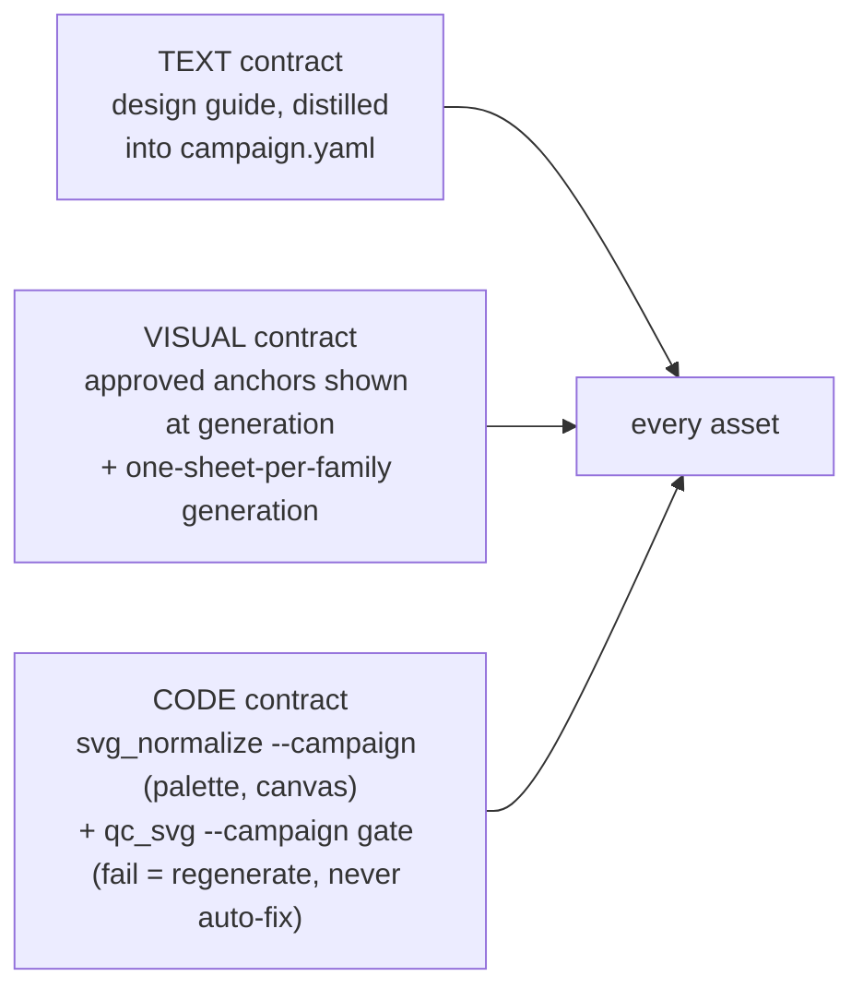
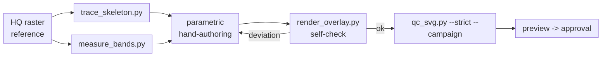

# OpenIllust Workflow — Deep Dive

Per-component detail behind [`WORKFLOW.md`](WORKFLOW.md): what every script and artifact actually
does, why it exists, the QC rule table, the plan/approval semantics (freeform and compose), the
`/opil:*` command surface, and the campaign contract schema. Read the overview first for the
pipeline diagrams and the three-layer consistency model; this document does not redraw them.

Two campaigns have validated this workflow end-to-end: **Planura** (a 3D architectural modeling
app; a 9-icon draw-tool family run through the sheet pipeline) and **OpenGoal** (a wordmark/logo
asset run through the freeform plan pipeline, and the source of the banner/wordmark lockup work
that proved out the composition route). Both are external campaigns, not this repo's content —
wherever a hex, a gradient id, a stroke range, or a prompt line appears below, it is a worked
example of that campaign's `campaign.yaml`, not a fixed rule of OpenIllust itself.

## Consistency model recap



| Actor | Responsibility |
|---|---|
| Owner (human) | Concept art, running image generation (gpt-image), visual approval, accent/style decisions, approving `campaign.yaml` and plans |
| Agent (Claude/Codex) | Manifests, prompts, campaign distillation, color `--map` choices, plan authoring, self-checks, repairs |
| Scripts | Everything deterministic: kit building, cropping, conversion, normalization, QC, self-check rendering, provenance |
| Vectorizer (recraft API / local vtracer) | Raster→vector conversion only, provider-switchable per campaign |

## Pipeline components

All scripts are pure Python (Pillow / svgelements / vtracer; PyYAML for the campaign loader; no
GPU) under `templates/skills/openillust/scripts/`:

```
templates/skills/openillust/scripts/
├── campaign.py            # [internal] loads + minimally validates campaign.yaml
├── make_sheet_guide.py    # [prepare] grid guide image + generation prompt builder
├── crop_sheet.py          # [slice] sprite sheet -> per-slug reference PNGs + provenance
├── vectorize.py           # [convert] provider-switchable raster->vector client
├── svg_normalize.py       # [normalize] palette snap, canvas bake, junk drop
├── qc_svg.py              # [gate] deterministic contract validator
├── render_overlay.py      # [self-check] headless browser render vs. reference, composited
├── trace_skeleton.py      # [measure] vertex skeleton extraction for parametric re-authoring
├── measure_bands.py       # [measure] color-band boundary measurement along an axis
├── typeset_svg.py         # [typeset] text + font -> outlined SVG, ink-bbox fit onto canvas
└── render_html.py         # [render] agent-authored HTML -> exact-size PNG/WEBP, blank-shot guard
```

Each script that reads style facts (`make_sheet_guide`, `svg_normalize`, `qc_svg`) REQUIRES
`--campaign <path to campaign.yaml>` — there are no built-in style defaults; the campaign is the
only style authority. A campaign that omits `palette.gradients` allows no gradients at all, and
one that omits `stroke.main` gets no stroke-width checking. (`vectorize.py` also accepts
`--campaign`, but only for the `tooling.vectorizer` default — it reads no style facts.)
`typeset_svg.py` accepts `--campaign` (with `--profile`) too, but only as one of several canvas
sources — it is optional, since `--canvas N|WxH` works standalone with no campaign at all.
`render_html.py` reads no style facts whatsoever: layout, color, and typography for a raster
deliverable live entirely in the HTML the agent authors.

### (1) Cell manifest

- **Path**: `.openillust/campaigns/<name>/sheets/<family>/manifest.txt`
- **Format**: one line per cell, `slug | Title | subject-and-action description`; `#`-prefixed
  lines are comments.

The single source of truth for cell order: the same file drives both prompt assembly (what the
image model draws in each numbered cell, via `make_sheet_guide.py`) and cropping (which slug each
cell is saved as, via `crop_sheet.py`) — so generation order and slicing order can never disagree.
Hand-written from the campaign's asset inventory, never generated.

### (2) campaign.py (internal loader)

Not a CLI entry point — a shared module imported by `qc_svg.py`, `svg_normalize.py`,
`make_sheet_guide.py`, and (lazily) `vectorize.py`. `load_campaign(path)` parses the YAML and
checks only the handful of keys every consumer needs before doing anything useful: `name`,
`canvas`, and a non-empty `palette.allowed`. It deliberately does **not** validate `stroke`, `qc`,
`normalize`, `prompt`, or any other key — each consumer script is responsible for defaulting the
additional keys it personally reads, since the schema explicitly allows a campaign to omit keys a
particular script doesn't need. A missing/malformed required key raises `CampaignError` with a
message naming the file and the missing key.

Import cost: the module requires PyYAML. Callers import it lazily at run time; in `vectorize.py`
the import happens only inside the `--campaign` branch, so vectorizing without a campaign never
requires PyYAML to be installed.

### (3) make_sheet_guide.py

`manifest.txt` [+ `campaign.yaml`] → `guide.png` + `prompt.txt`.

```bash
python make_sheet_guide.py --manifest .../sheets/draw-family/manifest.txt --rows 3 --cols 3 --campaign .../campaign.yaml
```

- **`guide.png`**: a content-free grid — cell borders, a dashed safe-area rectangle per cell
  (`--safe-ratio`, default `0.10`), and cell numbers. Tells the image model exactly where each cell
  will land, so the finished sheet crops cleanly.
- **`prompt.txt`**: assembles attachment roles ("the guide is layout-only, do not draw it"), the
  numbered cell list parsed from the manifest, and the campaign's `prompt.style_rules` +
  `prompt.palette_rules` + `prompt.avoid` blocks verbatim. In campaign mode, both
  `prompt.palette_rules` and `prompt.style_rules` are required — a campaign missing either is a
  hard error, not a silent fallback — while a missing `prompt.avoid` falls back to a generic
  built-in avoid-block. The kit framing itself is campaign-neutral: the campaign supplies the
  design-system name, the rule lines, and the avoid block.
- **Key parameters**: `--rows`/`--cols` (grid shape, required), `--cell` (guide cell size in px,
  default `340`), `--safe-ratio` (default `0.10`).

### (4) crop_sheet.py

`sheet.png` + `manifest.txt` → per-slug `reference.png` + `prompt-used.txt`.

```bash
python crop_sheet.py --input .../sheets/draw-family/sheet.png --manifest .../manifest.txt --rows 3 --cols 3 --trim 0.02 --refs-dir .openillust/campaigns/<c>/refs
```

- Slices the sheet on a uniform grid (`len(manifest)` must equal `rows*cols`), trims `--trim`
  (default `0.02`, i.e. 2%) off every cell edge to remove grid-line bleed, and upscales any cell
  below `--min-size` (default `512`) with Lanczos resampling — the Recraft vectorize API's floor is
  256px, so 512 leaves headroom.
- Writes `prompt-used.txt` per icon: which sheet, which cell index, the manifest's subject
  description, and a pointer to the sheet's `prompt.txt`. An icon without this file cannot be
  approved (provenance is mandatory, per the skill's core rules).
- Takes no `--campaign` flag — it only needs geometry (rows/cols/trim/min-size), not style facts.
  Its own `--refs-dir` default (`assets/refs`) is a pre-campaign legacy path; the owning
  `/opil:sheet` command always passes the campaign's actual refs directory explicitly.

### (5) vectorize.py

reference PNG → raw SVG. Provider-switchable; supersedes the old Recraft-only
`recraft_vectorize.py`.

```bash
python vectorize.py --input .../refs/tb_line/reference.png --output temp/raw/tb_line.raw.svg
python vectorize.py --input ref.png --output out.svg --provider vtracer
python vectorize.py --input ref.png --output out.svg --campaign .../campaign.yaml
```

Two built-in providers:

| Provider | Runs | Cost | Constraints |
|---|---|---|---|
| `recraft` (default) | Recraft API `POST /v1/images/vectorize` | 10 API units ($0.01/image) | PNG/JPG/WEBP, ≤10MB, 256–4096px (≤16MP) |
| `vtracer` | locally (the `vtracer` package) | $0 | no network, no key; rougher curves on complex shapes |

**Provider resolution order** (first match wins): `--provider` flag → `OPENILLUST_VECTORIZER`
environment variable → the active campaign's `tooling.vectorizer` (campaign.py is imported lazily
here, only if `--campaign` was given; a campaign silent on `tooling.vectorizer` falls through) →
default `"recraft"`. An unresolved/unknown provider name is a hard error naming the valid choices —
never a silent downgrade to a different provider.

For `recraft`, the API key resolves `--key` → `RECRAFT_API_KEY` env → `.env` (found by walking up
from the current working directory, since `.env` lives in the campaign's project, not next to the
installable skill; a bare single-line `.env` with just the key value is also tolerated). The key is
never printed, in output or in error messages. Design philosophy: a thin conversion client with no
creative judgment — it converts and downloads, nothing else; both providers' output is cleaned and
gated identically downstream, so switching providers never bypasses the contract.

### (6) svg_normalize.py

raw SVG → contract SVG. Turns "a picture" into "a system part."

```bash
python svg_normalize.py --input raw.svg --output icon.svg --campaign .../campaign.yaml --map "#112233=#3039C9"
```

- **Palette snapping**: parses the input with `svgelements` (`reify=True`, baking any transform
  into coordinates), then for each shape's original fill/stroke color, snaps to the nearest
  campaign palette hex by Euclidean RGB distance — unless a `--map SRC=DST` override matches that
  exact source hex first. `--map` is a per-sheet design decision: decided once, applied to every
  cell in that sheet.
- **Canvas fit**: computes the combined bounding box of every *kept* shape, then bakes a single
  translate+scale (fit into `--canvas` with `--margin` empty border, default from the campaign's
  `normalize.margin` or generic `0.13`) directly into each path's `d` attribute — geometry is
  rescaled and centered, never redrawn. `--canvas` also takes `WxH` (e.g. `1760x320`) for a
  non-square target: the margin is applied per axis, the fit scale stays uniform, and the output
  `viewBox` becomes `0 0 W H`.
- **Junk removal**: `--drop-color HEX` removes shapes whose *original* fill exactly matches (e.g. a
  raster converter's shadow layer); `--min-area-ratio` (campaign `normalize.min_area_ratio` or
  generic `0.0005`) drops shapes smaller than that fraction of the source canvas area as speckle —
  a campaign with dashed construction lines needs a much smaller ratio (e.g. `0.00002`, roughly
  25x tighter) so dash segments survive; `--drop-background` removes a near-white shape covering
  over 80% of both dimensions.
- **Output construction**: the result is written as a fresh minimal `<svg>` containing only the
  kept shapes as `<path>` elements with rounded (2-decimal) coordinates. Anything the raw
  converter's output carried that isn't a kept shape — editor metadata, embedded C2PA blobs, stray
  namespaces — is absent from the result as a side effect of rebuilding from scratch, not because
  the script runs a dedicated metadata-stripping pass.
- **Design philosophy**: never simplifies geometry. The only transform applied to a kept shape's
  path data is the uniform fit-to-canvas affine map — shapes the owner approved in the reference
  are preserved exactly, not redrawn or smoothed.

### (7) qc_svg.py

SVG → PASS/FAIL + violation list. The contract gate — validates only, never modifies a file.

```bash
python qc_svg.py .../icons/tb_line.svg --strict --campaign .../campaign.yaml
python qc_svg.py --dir .openillust/campaigns/<c>/icons/ --strict --json
```

Pure Python 3 standard library (`xml.etree.ElementTree`, `re`) — no third-party dependencies, runs
anywhere. `--strict` promotes every WARN to FAIL; `--json` emits a machine-readable report instead
of text; `--dir` validates every `*.svg` in a directory non-recursively. Exit codes: `0` all
passed, `1` at least one failure (or a warning under `--strict`), `2` usage/IO error.

Every check reads its thresholds from the campaign via `build_config()`; only the generic
occupancy/centering thresholds carry neutral product defaults when the campaign omits `qc.*` keys.
Content-occupancy and centering math uses the *contract's* expected canvas size
(the campaign's `canvas` field) rather than the file's own `viewBox` numbers —
so a broken `viewBox` (already caught separately) can't also corrupt the margin math. The
bounding-box approximation used for margin checks treats curve control points as bbox-contributing
points rather than solving true curve extrema — adequate for a sanity gate, not a geometry engine.

**`--profile <type>`** (requires `--campaign`) swaps in a per-deliverable canvas: the campaign's
`asset_profiles.<type>.canvas` (scalar or `[w, h]`) replaces the root `canvas` for both `viewBox`
and occupancy math, and a profile `qc:` block overrides the campaign's `qc.*` thresholds
field-by-field (an unset profile key still falls back to the campaign, then the product default).
Occupancy generalizes from "larger dimension" to `max(bbox_w/W, bbox_h/H)` — identical to the old
rule once `W == H` — and MARGIN003 centering checks each axis's offset against that axis's own
length rather than a single shared bound. Palette, gradients, and stroke are inherited from the
campaign unchanged; stroke ranges stay defined at root-canvas scale, a documented limitation for a
profile at a very different scale (e.g. a wide banner) than the campaign's icon canvas.

**Rule table** — codes are generic and apply to every campaign; the "example" column shows
Planura's actual `campaign.yaml` values, not a fixed rule:

| Code | Severity | Rule | Campaign source | Planura example |
|---|---|---|---|---|
| XML001 | FAIL | SVG must be well-formed XML | — | — |
| XML002 | FAIL | root element must be `<svg xmlns="http://www.w3.org/2000/svg">` | — | — |
| VIEWBOX001 | FAIL | `viewBox` exactly `"0 0 <canvas> <canvas>"` | `canvas` | `0 0 512 512` |
| COLOR001 | FAIL | every `fill`/`stroke`/`stop-color` is in the allowed palette, or `none`/`url(#id)` | `palette.allowed` | 11 hexes (`#3039C9`, `#4050F0`, `#2631A8`, `#2D39BD`, `#293AB4`, `#D0D8FA`, `#9EAFE9`, `#E5E9FC`, `#C4CCEF`, `#FFFFFF`, `#FAFAFC`) |
| GRADIENT001 | FAIL | only `linearGradient` defs, with `id` in the allowed set | `palette.gradients` keys | `planuraTop`, `planuraSide`, `planuraLightFace` |
| GRADIENT002 | FAIL | every `url(#id)` color reference resolves to a defined allowed gradient | `palette.gradients` | — |
| GRADIENT003 | FAIL, campaign-only | a gradient's `<stop>` colors match the exact stops declared for its id | `palette.gradients` values (id → stop list) | only enforced when the campaign declares exact stops |
| STROKE001 | FAIL | effective `stroke-width` within the main range; an optional dashed construction-color exception uses its own range | `stroke.main`, `stroke.construction` | main `[8, 13]`px; dashed `#9EAFE9` construction lines `[3, 6]`px |
| FORBID001 | FAIL | no `text`/`tspan`/`image`/`foreignObject`/`script`/`style`/`filter`/`fe*`/`animate*` | — | — |
| FORBID002 | FAIL | no inkscape/sodipodi/adobe editor-namespace elements or attributes | — | — |
| FORBID003 | FAIL | `href`/`xlink:href` never points outside the document (must start with `#`) | — | — |
| FORBID004 | FAIL | no `data:` inline URI anywhere | — | — |
| MARGIN001 | FAIL | content bbox's larger dimension within the hard occupancy bounds | `qc.occupancy_fail` | `[50%, 86%]` |
| MARGIN002 | WARN | content bbox within the recommended occupancy band | `qc.occupancy_warn` | `[68%, 82%]` |
| MARGIN003 | WARN | content bbox center within the max offset from canvas center, per axis | `qc.center_offset_max` | `6%` |
| DIM001 | WARN | root `<svg>` has no `width`/`height` attributes (viewBox-only sizing) | — | — |
| PREC001 | WARN | numeric coordinate precision ≤2 decimal places | — | — |
| LINECAP001 | WARN | `stroke-linecap`/`stroke-linejoin` in `{butt, miter, round}` | — | — |

Design philosophy: a gate, not a fixer. FAIL means rework the SVG or regenerate the reference and
re-run — the script never patches geometry to satisfy a numeric check while violating its intent.

### (8) render_overlay.py

`icon.svg` [+ reference PNG] → a `[reference | render | overlay]` composite PNG.

```bash
python render_overlay.py --svg .../icons/tb_line.svg --ref .../refs/tb_line/reference.png --out temp/overlay.png --zoom 100,100,300,300
```

Launches headless Microsoft Edge or Chrome (an isolated temp profile, so it never collides with a
browser the owner has open) to screenshot the SVG at `--size` (default 512). With `--ref`, blends
the render against the reference (`--ref-opacity`, default `0.5`) into a 3-panel strip; without,
just the render. `--zoom X0,Y0,X1,Y1` crops a canvas-coordinate box from every panel and magnifies
it 2× for junction-level inspection. This is the agent's self-check: look for silhouette drift,
proportion mismatches, or awkward joins and fix them *before* spending the owner's review cycle —
required before QC or an owner review on both the vectorize and parametric routes.

### (9) trace_skeleton.py

raster → per-region vertex skeletons (a coordinate-measurement tool, not a final SVG).

```bash
python trace_skeleton.py --input .../refs/hero_logo.png --fit --margin 0.13 --emit-svg temp/probe.svg
```

Runs `vtracer` in polygon mode (default `--hierarchical cutout`, non-overlapping visible regions)
against the raster, then simplifies each region's outline with Ramer–Douglas–Peucker
(`--eps-ratio`, default `0.008` of the longer image dimension) and keeps the largest
`--max-regions` (default 10) regions above `--min-area-ratio` (default `0.003`). `--fit` maps the
combined bbox into a `--scale` canvas (default 512) with `--margin` (default `0.13`) so the printed
vertex lists paste directly into hand-authored geometry. `--emit-svg` additionally writes a literal
trace probe (original traced colors, paint order preserved) — explicitly a fidelity probe, **not**
a contract-compliant icon; the agent still rebuilds final geometry with the campaign's palette,
gradients, and stroke rules. Used for freeform silhouettes the agent should not eyeball or invent.

### (10) measure_bands.py

raster + an axis definition → color-band boundary report.

```bash
python measure_bands.py --input .../refs/tb_pencil.png --p0 50,50 --p1 400,400 --cross 0.5 --along 20 --canvas-len 380
```

Given a subject axis (`--p0` tip, `--p1` far end, in image pixels), `--cross F` samples
perpendicular to the axis at fraction `F` of its length; `--along S` samples parallel to the axis
at perpendicular offset `S` px. Sampled colors are clustered into coarse families (white, dark,
navy, blue, red-lit, red-shade, gray, other) so anti-aliasing fringes don't fragment a run into
noise. `--canvas-len` additionally scales the axis-unit output to whatever length the axis will
occupy on the 512 canvas, for direct coordinate reuse (e.g. "body width 80 canvas-units; shading
starts at the centerline"). Replaces eyeballing with exact numbers when rebuilding geometry
parametrically.

### (11) typeset_svg.py

text + font → outlined SVG. The `typeset` route made executable — text is never traced.

```bash
python typeset_svg.py --text "State Designer" --font Inter-Medium.ttf --fill "#20211F" \
    --output wordmark.svg --campaign .../campaign.yaml --profile lockup
python typeset_svg.py --text "OpenGoal" --font Inter-Bold.ttf --fill "#111111" \
    --canvas 1024 --output wordmark.svg
```

- Shapes the text with HarfBuzz (real glyph shaping — kerning and ligatures, not per-character
  advance guessing), then emits each shaped glyph's outline directly as SVG path data via
  fontTools. No font is ever rasterized or auto-traced.
- **Canvas resolution** (first match wins): an explicit `--canvas N|WxH` → the campaign's
  `asset_profiles.<profile>.canvas` via `--campaign --profile` (scalar → square, `[w, h]` →
  non-square) → the campaign's root `canvas` → a hard error naming the missing source.
  `--campaign`/`campaign.py` is imported lazily, only on the branch that actually needs it, so a
  `--canvas`-only invocation never requires PyYAML (the same house pattern as `vectorize.py`).
- **Sizing**: the target ink width is `--target-width` px, or `--target-ratio` × the canvas width
  (default `0.6`; the two flags are mutually exclusive). An ink height that would exceed the canvas
  height is a hard error suggesting a smaller ratio/width, never a silent squeeze.
- `--font` accepts a path; a bare filename that doesn't resolve is also tried against
  `%WINDIR%\Fonts\<value>`.
- **Design philosophy**: text-never-traced made executable. It is the productized form of a
  golden-verified prototype — the shaping/outline/centering math is kept intact from the one-off
  script that produced OpenGoal's wordmark, not re-derived, so campaign-neutral wiring never
  drifts from behavior already proven against a shipped asset.

### (12) render_html.py

agent-authored HTML page → exact-size PNG (+ optional WEBP). The `compose` route's raster half,
and the concrete form of the scripts-never-draw split: the agent owns every visual decision in the
HTML/CSS it writes, and this script only proves the result renders correctly.

```bash
python render_html.py --html banner.html --size 1760x320 --out banner.png \
    --webp banner.webp --min-colors 50 --retries 3
```

- Launches headless Edge/Chrome (via `render_overlay.find_browser`, a fresh temp profile per
  attempt) to screenshot the page at `--size WxH`, then re-opens the saved PNG and hard-fails if
  its pixel dimensions don't exactly match the request — no silent letterboxing or DPI scaling.
- **Blank-render guard**: counts distinct colors in the shot; a render at or under `--min-colors`
  (default `50`) is treated as a flaked or blank capture and retried, up to `--retries` (default
  `3`) attempts, before exiting with an explicit error naming the threshold and attempt count.
- `--webp` additionally saves a **lossless** WEBP of that same accepted frame — no re-render, no
  quality loss relative to the PNG.
- **Design philosophy**: scripts never draw, made literal for raster output. Layout, color, and
  typography live in HTML the agent authors; the script's only judgment is a mechanical one —
  right size, not blank.

### Non-script components

- **Preview page** (`preview.html` + `variants.js`) — the owner-facing acceptance view (a size ramp
  from 16–128px, background toggle, auto-refresh as SVGs change). It is campaign-workspace
  acceptance material assembled per campaign, not a script this repo ships; `/opil:sheet`,
  `/opil:vectorize`, and `/opil:redo` each "add preview entries," and `/opil:review` points the
  owner at the resulting page.
- **`build_manifest.py`** *(planned, not yet built)* — a future per-icon status manifest (prompt,
  reference, QC result, approval) aggregated from the filesystem. `approvals.md` (below) is the
  interim ledger until it exists.

## Plan pipeline — Plan → Approve → Execute

For an arbitrary source image that doesn't map to a sheet, or a derivation brief for assembling
deliverables from what the campaign already owns, the agent proposes a plan; the owner approves it
(possibly with edits); only then does execution start. Sheet mode skips this step entirely — its
manifest is a pre-approved plan. `/opil:vectorize` opens image-sourced plans; `/opil:compose` opens
brief-sourced plans with no source image at all (lockups, banners, social cards) — same file
format, same approval machinery, a different body (below).

**File**: `.openillust/campaigns/<name>/plans/YYYY-MM-DD-<slug>.md`, front-matter
`campaign` / `source` (the image path for a `/opil:vectorize` plan, copied into the workspace for
provenance — a `/opil:compose` plan's brief has no source image) / `status`
(`proposed | approved | executed`) — the state marker a re-invocation of `/opil:vectorize` or
`/opil:compose` resumes from.

**Body** (`/opil:vectorize` plans): an Assets table (`# | Asset | Region (x,y,w,h) | Route | Output
| Notes`), a Palette map table (source color → campaign color → role), and an Open questions list —
each question should carry a default so silence doesn't block approval. A `/opil:compose` plan uses
a different body — see "Compose-mode plans" below.

**Routes** (the core per-asset judgment):

| Route | When | Execution |
|---|---|---|
| `parametric` | simple/geometric shapes — exact curves beat tracing | hand-authored geometry; measured with `trace_skeleton.py` / `measure_bands.py`; self-checked with `render_overlay.py`; $0 |
| `vectorize` | organic/complex flat art, faithful reproduction wanted | crop region → `vectorize.py` → `svg_normalize.py --map` → QC |
| `typeset` | ANY text — wordmarks, labels | re-set with the real font; **text is never traced**; unknown font → open question or exclude |
| `exclude` | captions, decorative text, non-assets | listed explicitly so the owner sees what's left out |
| `drop` | backgrounds, shadows, textures | removed at normalize time (`--drop-background`, `--drop-color`) |
| `reuse` | an approved campaign asset needed as a component | referenced verbatim from `icons/`/`anchors/` (must appear in `approvals.md`); translate/scale only — a recolor or path edit is a new asset, routed `parametric` |
| `ingest` | an externally produced SVG (designer handoff) | `svg_normalize.py --campaign` (`--canvas WxH` for non-square targets) → QC, skipping the converter entirely |
| `compose` | a deliverable assembled from components (lockups, banners, social cards) | an assembly recipe script (SVG output, gated by `qc_svg.py --strict --campaign --profile <type>`) or agent-authored HTML → `render_html.py` (raster output, exact-dimension + blank-render guard); components come from the `reuse` / `typeset` / `parametric` rows above |

Defaults, overridable at approval: primitive count ≤~6 with straight/arc geometry suggests
`parametric`; photographic/3D-rendered/heavily textured content is flagged — the vectorizer will
produce artifacts (a stated limitation shared by both providers) — proposing `exclude` or a
regenerated flat reference instead.

**Compose-mode plans** (opened by `/opil:compose`, no source image): the body swaps the Assets/
Palette-map tables for a Deliverables table (`# | Output | Profile | Format | Components`), a
Components table (`Component | Route | Source / text | Notes`, each component itself routed
`reuse` / `typeset` / `parametric` / etc.), and a Layout section (per-deliverable assembly geometry
for an SVG output, or the HTML recipe outline for a raster one). Every deliverable names an
`asset_profiles` profile; a campaign missing that profile becomes an open question proposing
canvas/format values, never an invented one. Two hard rules are specific to derived assets:
**recipes are provenance** — the script that assembled or rendered a deliverable (assembly script,
typeset invocation, HTML render) is copied beside the plan in `plans/` before `status: executed`,
so a deliverable whose recipe lives only in a session scratchpad is not done — and **reused
components are never mutated**: translate/scale only, and only assets recorded as approved in
`approvals.md` may be reused.

**Approval semantics** (these govern every owner-approval moment in the workflow — freeform plans,
sheet cell manifests, and review promotions alike, not only this document):

- **Affordance** — every plan presentation ends by stating the exact approval keywords in the
  conversation language (e.g. "approve"/"proceed") and that any other reply is a modification or a
  question. Positive sentiment ("looks good") is never approval.
- **Defaults** — on approval, unanswered open questions resolve to their stated defaults; a
  question without one blocks only the assets depending on it, not the whole plan.
- **Mixed replies** — edits plus a go-signal in one reply: apply the edits, record them, then
  proceed as approved. An ambiguous edit is a question, never a guess.
- **Scope guard** — approval binds only to the plan just presented in this conversation; a go-word
  elsewhere never starts execution. On session resume, the plan summary and affordance are
  re-presented before accepting approval.
- **Durable write** — on approval: `status: approved` in the front-matter, defaults resolved into
  the plan body, and an append to `approvals.md` — date, plan path, the owner's approving utterance
  quoted verbatim (any language), and the defaults resolved.

**Hard rules**: no execution before `status: approved`; text is never traced (typeset or exclude,
no third option); every produced asset gets provenance and passes `qc_svg.py --strict` under the
campaign contract (per-asset-type canvas, e.g. a logo at 1024); region crops feeding the converter
need ≥256px on the short side; the plan lists everything visible in the source image — assets,
exclusions, and drops — so approval is fully informed; every derived asset's recipe script is
copied beside the plan before `status: executed` (recipes are provenance); reused components are
never mutated — translate/scale only, `approvals.md`-listed assets only.

## The `/opil:*` command surface

Seven commands, each loading the `openillust` skill first and owning one workflow entry point.
State lives on disk (directory-as-state) — every command resumes from what it finds there.

| Command | Does | Resumes from |
|---|---|---|
| `/opil:init <name>` | Create or resync a campaign: distill the design guide into `campaign.yaml`, with the owner's approval | whether `campaign.yaml` already exists — absent → create mode; present → resync mode with a field-level diff |
| `/opil:sheet <family>` | Batch-produce a family via one sprite sheet | the contents of `sheets/<slug>/` — no manifest → plan; manifest + kit, no `sheet.png` → waiting; `sheet.png` present → process |
| `/opil:vectorize <image>` | Freeform art → per-asset plan → approved execution | the plan's front-matter `status` — proposed → continue the approval conversation; approved → execute; executed → report and hand off |
| `/opil:compose <brief\|slug>` | Derive lockups/banners/social cards from approved components → per-deliverable plan → approved execution | the plan's front-matter `status` — proposed → continue the approval conversation; approved → execute; executed → report and hand off |
| `/opil:redo <slug> [feedback]` | Rework one rejected asset, anchor-chained | the asset's origin (a sheet manifest or a plan) and the owner's rework feedback |
| `/opil:review` | Walk the approval loop over QC-passed assets | preview entries with no matching `approved`/`rejected` line in `approvals.md` |
| `/opil:status [name]` | Campaign dashboard, derived from the filesystem | nothing to resume — a read-only snapshot across approvals, sheets, plans, and contract gaps |

## The approvals ledger

`.openillust/campaigns/<name>/approvals.md` is the single append-only record of every
owner-approval moment in a campaign — never rewritten, only appended to. It carries two kinds of
entries:

- **Per-asset verdicts**, written by `/opil:review`: `YYYY-MM-DD <slug> approved|rejected [note]`.
  Only QC-passed assets are ever presented for a verdict.
- **Plan approvals**, written per the plan pipeline's Durable-write rule above: date, plan
  path, the owner's verbatim approving utterance, and any defaults resolved.

It is explicitly the interim ledger until `build_manifest.py` exists to aggregate status
mechanically; anchor promotion (approved asset → `anchors/`) still requires an explicit owner "yes"
per asset, asked once and recorded alongside the verdict.

## Parametric fallback lane

For single hero assets, logos, or geometry the vectorizer mangles — and for any freeform-plan asset
routed to `parametric`:



The reference is intent, not pixels: geometry is rebuilt as clean vector shapes (integer/half-unit
coordinates, exact campaign palette hexes, gradients only from `palette.gradients`), reusing
approved anchors' structural conventions verbatim rather than re-deriving them per asset.
Deviation policy: where the raster reference conflicts with the campaign contract, the contract
wins — minor raster flaws are corrected silently; major ones (wrong perspective, off-brand look)
mean regenerating the raster, never shipping an off-brand reference as the archived one. Reached
through `/opil:vectorize`'s `parametric` route, or `/opil:redo` when reworking a single rejected
asset.

## Key parameters & tips

- Dashed construction lines need a much smaller `svg_normalize.py --min-area-ratio` than the
  `0.0005` generic default (an example campaign value like `0.00002`) so the dash segments survive.
- `--map SRC=DST` is a once-per-sheet decision, reused for every cell in that family.
- Recraft's floor is 256px on the short side; `crop_sheet.py` upscales every cell to ≥512px by
  default, leaving headroom.
- Sheets default to ~9 cells (3×3) — larger grids starve per-cell resolution at typical
  image-generation output sizes.
- A mid-family vectorizer-provider swap can shift curve texture in ways QC doesn't measure — pin
  one provider per family for its lifetime, and treat a missing API key as an error, never a
  silent fallback to a different provider.
- Two consecutive failed regenerations of the same asset (QC fail, or visibly off-brand) means stop
  and report to the owner with what was produced so far — not another retry.

## Campaign contract

Every campaign lives under `.openillust/campaigns/<name>/`, anchored by `campaign.yaml`. Schema
(full reference: `templates/skills/openillust/references/campaign-schema.md`):

| Field | Required | Holds |
|---|---|---|
| `name` | yes | campaign slug |
| `design_guide` | yes | path to the human style document this was distilled from |
| `canvas` | yes | square viewBox size |
| `palette.allowed` | yes | every hex QC accepts, including backgrounds |
| `palette.gradients` | no | whitelisted `id → [start, end]` gradient defs |
| `palette.accent` | no | `{ hex, scope }`; `hex: null` means adopted but not yet chosen |
| `stroke.main` | for stroke styles | `{ width: [min, max] }`, px at canvas scale |
| `stroke.construction` | no | dashed exception lane: `{ color, requires_dash, width }` |
| `qc.occupancy_warn` / `occupancy_fail` / `center_offset_max` | yes | gate thresholds, as fractions of canvas |
| `normalize.margin` / `min_area_ratio` | no | `svg_normalize.py` defaults |
| `prompt.palette_rules` / `style_rules` / `avoid` | yes for sheet mode | verbatim lines injected into the sheet-generation prompt |
| `asset_profiles.<type>` | no | per-type overrides — `canvas` (scalar or `[w, h]`), an optional `qc:` threshold-override block, `format: svg\|webp\|png` for raster deliverables. Read by `qc_svg.py --profile <type>` (canvas replaces the root canvas; `qc:` overrides field-by-field) and by the compose flow for deliverable format |
| `tooling.vectorizer` | no | execution default (`recraft` or `vtracer`) — advisory, not part of the style contract |

Unknown extra keys are allowed (campaigns differ; consumers read what they know). `/opil:init`
writes this file once, distilling it from the free-form design guide via
`templates/skills/openillust/references/distill-guide.md` (glob for guide candidates, read fully,
extract field by field, interview the owner for every gap, propose with a per-field source note,
write only on approval, scaffold the workspace: `anchors/ refs/ sheets/ plans/ icons/ preview/`).
Re-running it later resyncs against a changed guide with a field-level diff — the guide stays the
human authority; the yaml never drifts silently.

`tooling.vectorizer` picks between the two `vectorize.py` providers:

| Provider | Cost | Quality | Key |
|---|---|---|---|
| `recraft` (default) | ~$0.01/image | best-in-class flat-art tracing | `RECRAFT_API_KEY` in `.env` |
| `vtracer` | free | good on simple flat shapes, rougher curves | none |

It is advisory execution config, not style contract — but because a mid-family provider swap can
shift curve texture in ways QC does not measure, pin one provider per asset family for its
lifetime.
