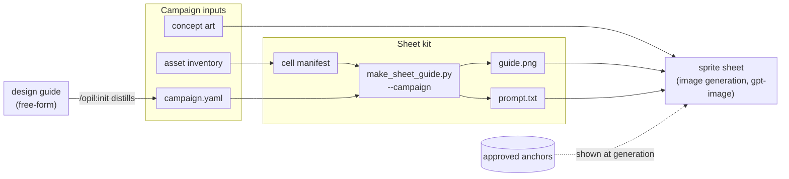
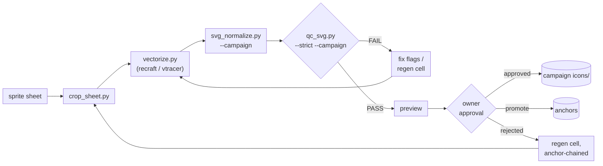
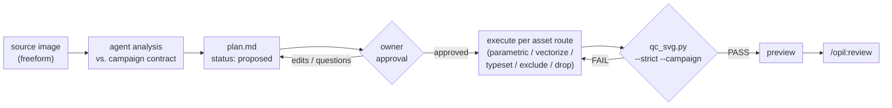
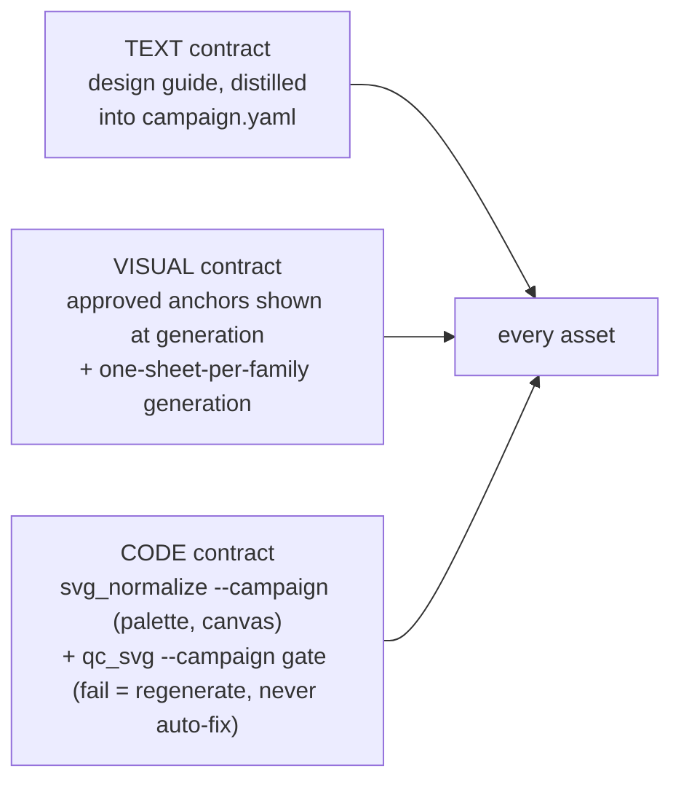

# OpenIllust Workflow

OpenIllust turns a campaign's design language into a consistent set of contract-compliant vector
assets — icons, logos, illustrations — through three production routes, all gated by the same
deterministic QC. This repo is the product (`@opellen/openillust`): the skill, the six `/opil:*`
commands, and the Python toolchain implementing the workflow below. Every campaign that uses it
lives in the *user's* project, under `.openillust/campaigns/<name>/` — this repo ships no campaign
content of its own.

## Overview

**Sheet pipeline, stage 1 — Prepare & generate** (campaign inputs → one sheet per family):

**Sheet pipeline, stage 2 — Convert, gate, review** (sheet → approved SVGs):

**Freeform plan pipeline — Plan → Approve → Execute** (arbitrary source art → approved assets):

Node details (what each step does, parameters, costs) live in the tables below and in the
[deep dive](WORKFLOW-deep-dive.md) — the charts above carry only the flow.

## Consistency model (three layers)

## Production routes

| Route | Owning command | When |
|---|---|---|
| Sheet (primary) | `/opil:sheet` | batch-producing a family of related assets in one generation |
| Freeform plan | `/opil:vectorize` | an arbitrary source image that doesn't map to a sheet |
| Parametric fallback | reached via either route's `parametric` step, or `/opil:redo` | single hero assets, logos, or geometry the vectorizer mangles |

## Roles

| Actor | Responsibility |
|---|---|
| Owner (human) | Concept art, running image generation, visual approval, accent/style decisions, approving `campaign.yaml` and plans |
| Agent (Claude/Codex) | Manifests, prompts, campaign distillation, color `--map` choices, plan authoring, self-checks, repairs |
| Scripts | Everything deterministic: kit building, cropping, conversion, normalization, QC, self-check rendering, provenance |
| Vectorizer (recraft API / local vtracer) | Raster→vector conversion only, provider-switchable per campaign — the one specialized external dependency when `recraft` is used |

## Pipeline components

Current script names and campaign-workspace paths. Full per-script behavior, parameters, and
design rationale are in the [deep dive](WORKFLOW-deep-dive.md).

| Component | Path | Job |
|---|---|---|
| `campaign.yaml` | `.openillust/campaigns/<name>/campaign.yaml` | machine-readable contract: palette, canvas, stroke rules, QC thresholds, prompt blocks |
| cell manifest | `.openillust/campaigns/<name>/sheets/<family>/manifest.txt` | one line per cell; single source of truth for both prompt assembly and cropping order |
| `make_sheet_guide.py` | `templates/skills/openillust/scripts/` | manifest + campaign → `guide.png` (layout-only grid) + `prompt.txt` |
| `crop_sheet.py` | `templates/skills/openillust/scripts/` | sheet PNG → per-slug `.../refs/<slug>/reference.png` + provenance |
| `vectorize.py` | `templates/skills/openillust/scripts/` | reference PNG → raw SVG (provider: `recraft` API or local `vtracer`) |
| `svg_normalize.py` | `templates/skills/openillust/scripts/` | raw SVG → contract SVG (palette snap, canvas bake, junk drop) |
| `qc_svg.py` | `templates/skills/openillust/scripts/` | the contract gate: PASS/FAIL + violation list |
| `render_overlay.py` | `templates/skills/openillust/scripts/` | headless render vs. reference — the agent's self-check |
| `trace_skeleton.py` / `measure_bands.py` | `templates/skills/openillust/scripts/` | measurement aids for the parametric fallback |
| plan | `.openillust/campaigns/<name>/plans/<date>-<slug>.md` | freeform Plan → Approve → Execute artifact |
| approvals ledger | `.openillust/campaigns/<name>/approvals.md` | append-only record of every owner-approval moment |

## Key parameters

- `svg_normalize.py --margin` / `--min-area-ratio` default from the active campaign's
  `normalize.*` (generic fallbacks `0.13` / `0.0005` when the campaign omits them). A much
  smaller `min_area_ratio` (a campaign might use `0.00002`) keeps dashed construction segments from
  being deleted as speckle.
- `--map SRC=DST` is a per-sheet design decision: decided once per sheet, reused for every cell in
  it.
- Vectorizer inputs need ≥256px on the short side (API minimum); `crop_sheet.py` upscales to its
  `--min-size` default (512px).
- Sheets default to ~9 cells (3×3): larger grids starve per-cell resolution at image-generation
  output sizes.
- Vectorizer provider resolves `--provider` > `OPENILLUST_VECTORIZER` env > campaign
  `tooling.vectorizer` > `recraft` default. A missing API key is a loud error, never a silent
  fallback — pin one provider per asset family.

## Campaign contract

Generalization is no longer a to-do: every campaign lives under `.openillust/campaigns/<name>/`,
anchored by `campaign.yaml` — the single machine-readable contract for that campaign's palette,
canvas, stroke rules, QC thresholds, and prompt language. Nothing in the pipeline reads a hex code,
canvas size, or avoid-list line from anywhere else.

- `/opil:init <name>` distills a free-form design guide (any shape — a ChatGPT export, an agency
  PDF-to-markdown, a hand-written doc) into `campaign.yaml`, interviews the owner for anything the
  guide doesn't answer, and writes the file only on approval (procedure:
  `templates/skills/openillust/references/distill-guide.md`).
- Schema: `templates/skills/openillust/references/campaign-schema.md` — required keys `name`,
  `design_guide`, `canvas`, `palette.allowed`; optional `palette.gradients` / `palette.accent`,
  `stroke.main` / `stroke.construction`, `qc.*` thresholds, `normalize.*` defaults,
  `prompt.palette_rules` / `style_rules` / `avoid`, `asset_profiles.*`, and `tooling.vectorizer`.
- Every script that needs style facts (`make_sheet_guide`, `svg_normalize`, `qc_svg`) requires
  `--campaign <path>` — no built-in style defaults; the campaign is the only style authority.
- Re-running `/opil:init` on an existing campaign resyncs it: the guide is re-distilled and a
  field-level diff against the current yaml is presented before anything is written — the guide
  stays the human authority; the yaml never drifts silently.

See the [deep dive](WORKFLOW-deep-dive.md) for the full schema walkthrough, the QC rule table, the
freeform plan/approval semantics, and per-script detail.
